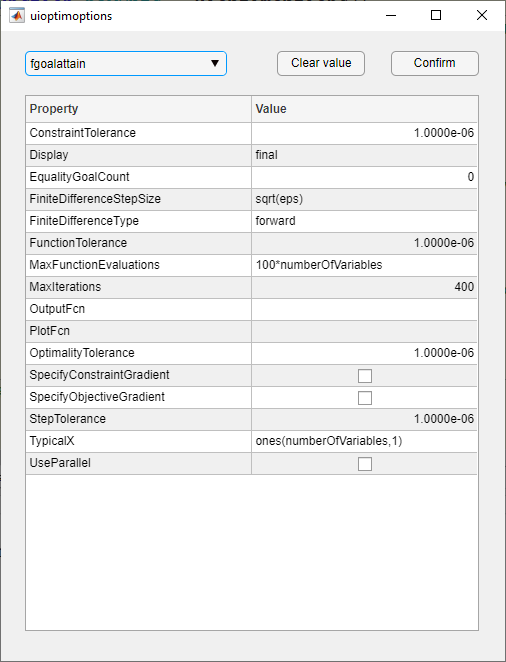

# uioptimoptions
Provides UI for optimoptions in MATLAB

MATLAB File Exchange link

Function uioptimoptions provides a simple UI for users who would like to edit the solver options interactively

Example: opts = uioptimoptions
OUTPUT: optim.options.Solvername class

This function will create a optim.options.Solvername class with the
settings obtained from the user input in UI

Tested: R2020b

Author: Mario Malic mario@mariomalic.com

History:
  06-Dec-2020, release
  
### Screenshot

